# Visual Diagrams 📊

> *Understanding Infin.Love through visual representations*

This document provides visual diagrams to help you understand complex workflows, architecture, and processes. All diagrams use [Mermaid](https://mermaid.js.org/) which renders automatically on GitHub.

---

## Contribution Workflow

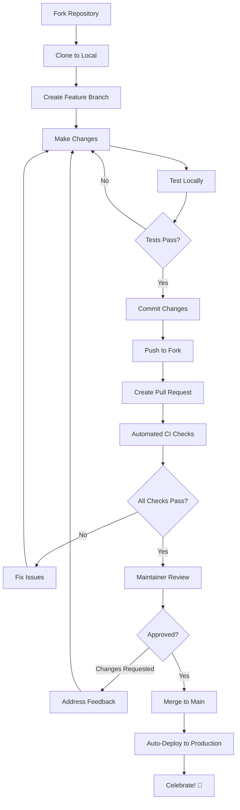

**Learn more:** [CONTRIBUTING.md](CONTRIBUTING.md)

---

## Learning Path Journey

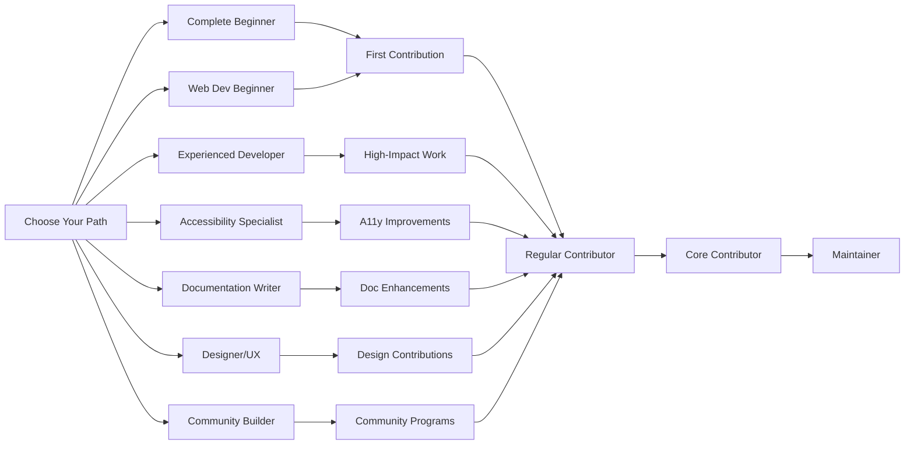

**Learn more:** [LEARNING_PATHS.md](LEARNING_PATHS.md)

---

## CI/CD Pipeline

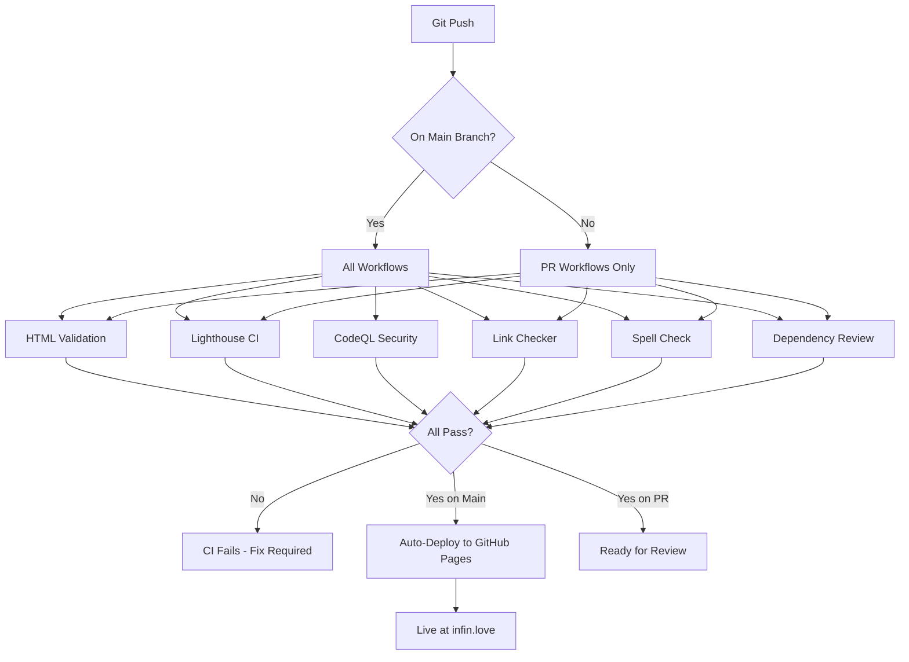

**Learn more:** [TESTING.md](TESTING.md)

---

## Project Architecture

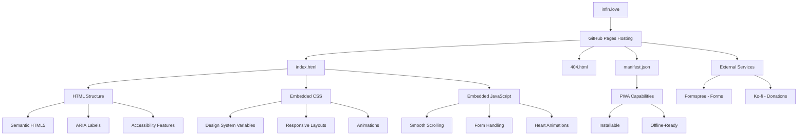

**Learn more:** [ARCHITECTURE.md](ARCHITECTURE.md)

---

## Documentation Structure

```mermaid
graph TD
    A[Documentation Hub] --> B[Getting Started]
    A --> C[Development]
    A --> D[Community]
    A --> E[Governance]

    B --> B1[QUICK_START.md]
    B --> B2[LEARNING_PATHS.md]
    B --> B3[ONBOARDING.md]
    B --> B4[EXAMPLES.md]
    B --> B5[TROUBLESHOOTING.md]

    C --> C1[CONTRIBUTING.md]
    C --> C2[DESIGN.md]
    C --> C3[ARCHITECTURE.md]
    C --> C4[TESTING.md]
    C --> C5[DEPLOYMENT.md]

    D --> D1[COMMUNITY.md]
    D --> D2[VISION.md]
    D --> D3[ROADMAP.md]
    D --> D4[CODE_OF_CONDUCT.md]
    D --> D5[PRESS_KIT.md]

    E --> E1[GOVERNANCE.md]
    E --> E2[MAINTAINERS.md]
    E --> E3[SECURITY.md]
    E --> E4[ANALYTICS.md]
```

**Learn more:** [README.md](README.md#-documentation)

---

## Security Scanning Flow

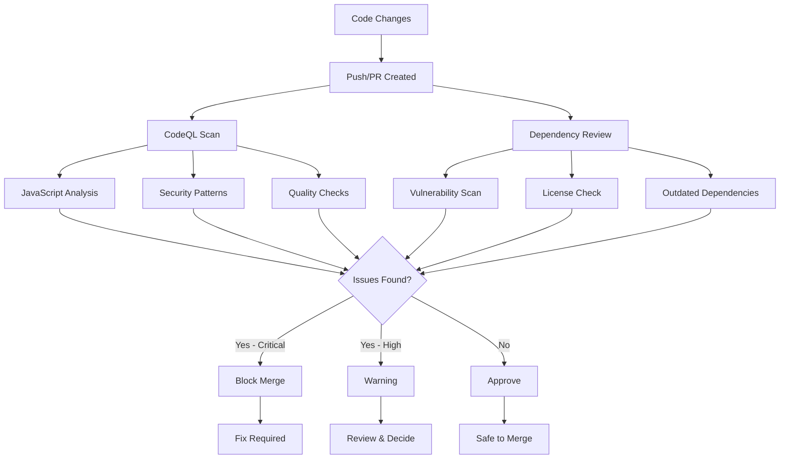

**Learn more:** [SECURITY.md](SECURITY.md)

---

## Gift Circle Flow

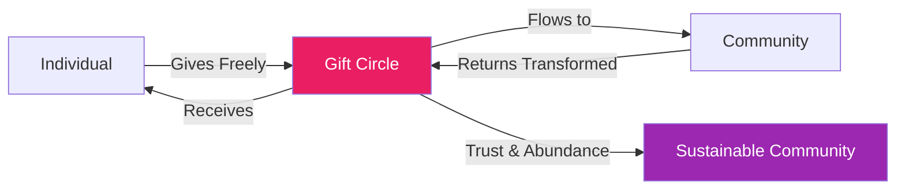

**vs. Traditional Exchange:**

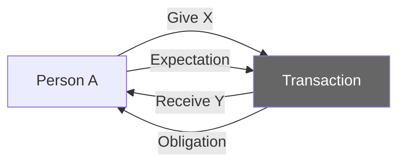

**Learn more:** [COMMUNITY.md](COMMUNITY.md)

---

## Issue Lifecycle

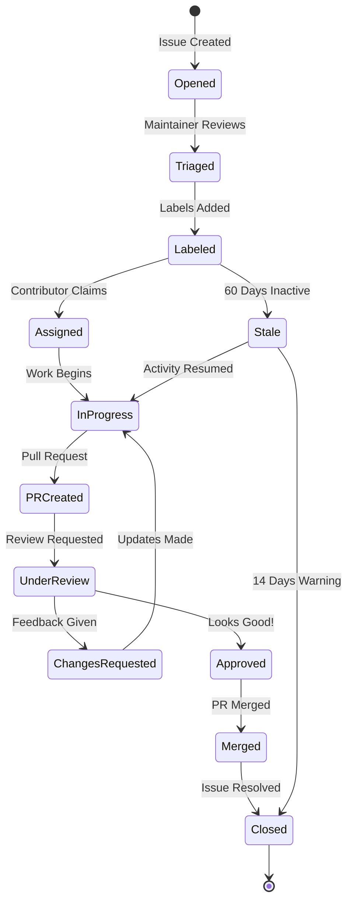

**Learn more:** [CONTRIBUTING.md](CONTRIBUTING.md)

---

## Accessibility Testing Process

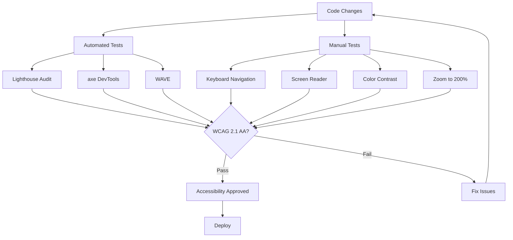

**Learn more:** [TESTING.md](TESTING.md#accessibility-testing)

---

## Release Process

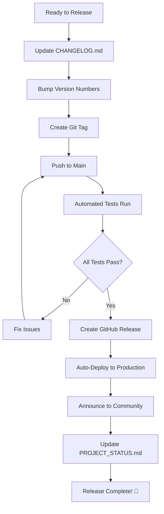

**Learn more:** [DEPLOYMENT.md](DEPLOYMENT.md)

---

## Contributor Recognition Flow

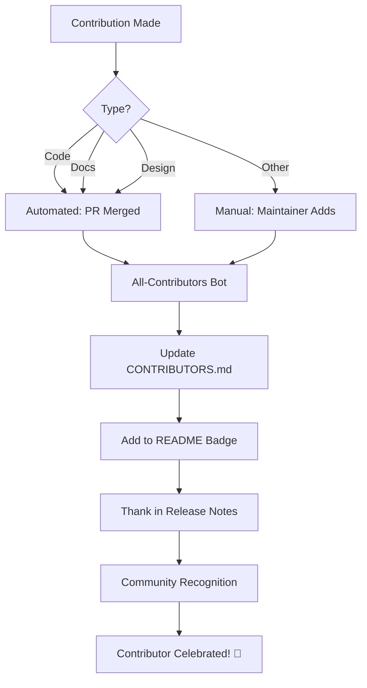

**Learn more:** [CONTRIBUTORS.md](CONTRIBUTORS.md)

---

## Deployment Workflow

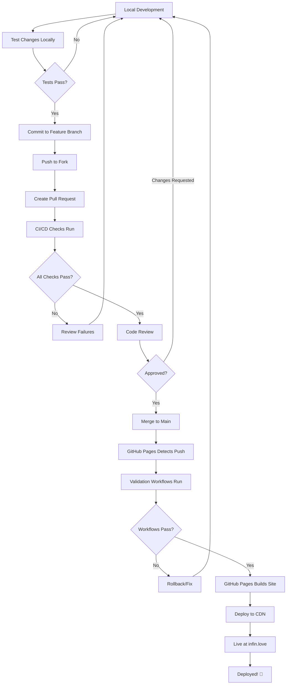

**Learn more:** [DEPLOYMENT.md](DEPLOYMENT.md)

---

## Testing Workflow

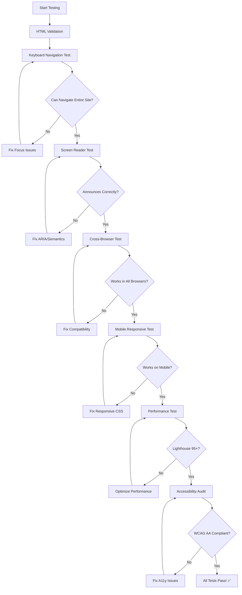

**Learn more:** [TESTING.md](TESTING.md)

---

## Documentation Contribution Flow

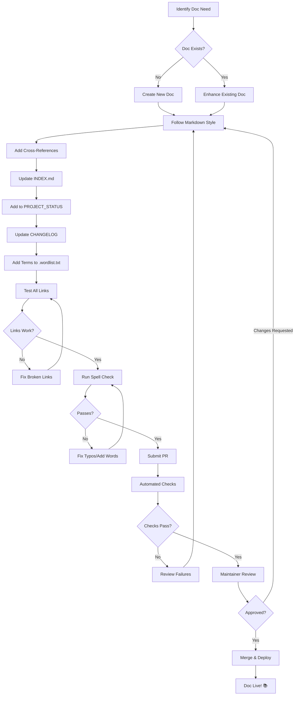

**Learn more:** [CONTRIBUTING.md](CONTRIBUTING.md) • [INDEX.md](INDEX.md)

---

## Metrics Tracking Workflow

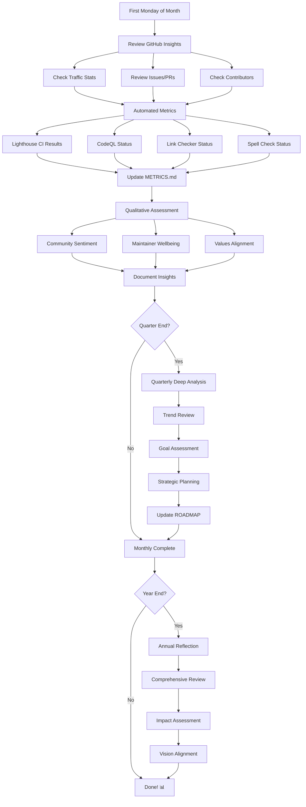

**Learn more:** [METRICS.md](METRICS.md) • [PROJECT_STATUS.md](PROJECT_STATUS.md)

---

## Using These Diagrams

### View on GitHub
All diagrams render automatically when viewing this file on GitHub.

### Edit Diagrams
1. Use [Mermaid Live Editor](https://mermaid.live/)
2. Copy diagram code
3. Make changes
4. Test rendering
5. Submit PR with updates

### Add New Diagrams
We welcome new diagrams! Consider adding:
- User journeys
- Data flow diagrams
- Sequence diagrams
- State machines

See [Mermaid Documentation](https://mermaid.js.org/intro/) for syntax.

---

**Visual thinking aids understanding** 💡

**Suggest improvements:** [Open an Issue](https://github.com/Luminous-Dynamics/infin-love/issues/new?template=feature_request.yml)

[⬆ Back to Top](#visual-diagrams-)

